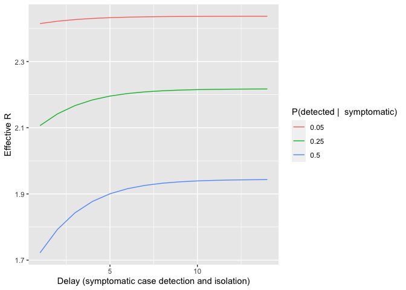

<!-- README.md is generated from README.Rmd. Please edit that file -->

# tti

<!-- badges: start -->

[](https://travis-ci.org/HopkinsIDD/tti)
[](https://codecov.io/gh/HopkinsIDD/tti?branch=master)
<!-- badges: end -->

The goal of tti is to facilitate the recursive calculation of infection
proportions for the test-trace-isolate process.

## Installation

You can install the development version of tti from GitHub with:

``` r
devtools::install_github("HopkinsIDD/tti")
```

## Examples

``` r
library(tti)
```

The `get_dqc_equilibrium()` function will iterate through the
detected-quarantine-community vectors until “equilibrium” is met, as
specified by the `tolerance` parameter. For example, here we start with
80% symptomatic in the community and 20% asymptomatic in the community.

``` r
dqc <- get_dqc_equilibrium(init = c(Ds = 0, Da = 0, Qcds = 0, Qhds = 0,
                                    Qcda = 0, Qhda = 0, Qq = 0, Cs = 0.8,
                                    Ca = 0.2))
dqc
#>           Ds           Da         Qcds         Qhds         Qcda         Qhda 
#> 0.0768155690 0.0096019461 0.0074079812 0.0296319249 0.0004629988 0.0018519953 
#>           Qq           Cs           Ca 
#> 0.0004504876 0.6913401207 0.1824369763
```

From this, we can calculate the proportion quarantined using the
`get_prop_quarantined()` function.

``` r
get_prop_quarantined(dqc)
#> [1] 0.03980539
```

We can then calculate the \(R_{effective}\) under this scenario.

``` r
get_r_effective(dqc)
#> [1] 2.361799
```

The function `get_proportions_df()` will generate a data frame with four
columns:

  - `t`: the time (iteration)  
  - `prop_infected`: The proportion infected  
  - `r_effective`: The effective R value
  - `category`: The category

For example, to run the recursive function over 10 time points, we would
run the following.

``` r
d <- get_proportions_df(duration = 10)
d
#> # A tibble: 90 x 4
#>        t prop_infected r_effective category
#>    <dbl>         <dbl>       <dbl> <chr>   
#>  1     1          0           2.5  Ds      
#>  2     1          0           2.5  Da      
#>  3     1          0           2.5  Qcds    
#>  4     1          0           2.5  Qhds    
#>  5     1          0           2.5  Qcda    
#>  6     1          0           2.5  Qhda    
#>  7     1          0           2.5  Qq      
#>  8     1          0.8         2.5  Cs      
#>  9     1          0.2         2.5  Ca      
#> 10     2          0.08        2.46 Ds      
#> # … with 80 more rows
```

``` r
library(ggplot2)
ggplot(d, aes(x = t, y = prop_infected, color = category)) + 
  geom_line() + 
  scale_y_continuous("Proportion of Infected")
```


We can then calculate the effective \(R\) after each iteration.

``` r
library(dplyr)
r <- d %>%
  distinct(t, r_effective)
r
#> # A tibble: 10 x 2
#>        t r_effective
#>    <dbl>       <dbl>
#>  1     1        2.5 
#>  2     2        2.46
#>  3     3        2.36
#>  4     4        2.36
#>  5     5        2.36
#>  6     6        2.36
#>  7     7        2.36
#>  8     8        2.36
#>  9     9        2.36
#> 10    10        2.36
```

``` r
ggplot(r, aes(x = t, y = r_effective)) +
  geom_line() +
  scale_y_continuous("Effective R")
```


We can also look at the \(R_{effective}\) over a variety of parameters
using the `get_r_effective_df()` function. This can take parameters as
either single number scalars or vectors of parameters to try. For
example, if we wanted to look at how \(R\) is affected by varying `t_ds`
between 1 and 14 and `rho_s` values of 0.05, 0.25, and 0.5, we would run
the following.

``` r
d <- get_r_effective_df(t_ds = 1:14, 
                        rho_s = c(0.05, 0.25, 0.5))
d
#> # A tibble: 42 x 18
#>    r_effective alpha     R kappa   eta    nu  t_ds  t_da t_qcs t_qca t_qhs t_qha
#>          <dbl> <dbl> <dbl> <dbl> <dbl> <dbl> <int> <dbl> <dbl> <dbl> <dbl> <dbl>
#>  1        2.41   0.2   2.5   0.5   0.5     4     1     3     3     3     3     3
#>  2        2.42   0.2   2.5   0.5   0.5     4     2     3     3     3     3     3
#>  3        2.43   0.2   2.5   0.5   0.5     4     3     3     3     3     3     3
#>  4        2.43   0.2   2.5   0.5   0.5     4     4     3     3     3     3     3
#>  5        2.43   0.2   2.5   0.5   0.5     4     5     3     3     3     3     3
#>  6        2.43   0.2   2.5   0.5   0.5     4     6     3     3     3     3     3
#>  7        2.44   0.2   2.5   0.5   0.5     4     7     3     3     3     3     3
#>  8        2.44   0.2   2.5   0.5   0.5     4     8     3     3     3     3     3
#>  9        2.44   0.2   2.5   0.5   0.5     4     9     3     3     3     3     3
#> 10        2.44   0.2   2.5   0.5   0.5     4    10     3     3     3     3     3
#> # … with 32 more rows, and 6 more variables: t_q <dbl>, omega_c <dbl>,
#> #   omega_h <dbl>, omega_q <dbl>, rho_s <dbl>, rho_a <dbl>
```

This gives us a data frame with 18 columns, the first being the
\(R_{effective}\) and the subsequent columns detailing the parameters.
Notice here there are 52 rows, because we had 52 combinations of `t_ds`
and `rho_s` that we provided.

``` r
ggplot(d, aes(x = t_ds, y = r_effective, color = factor(rho_s))) +
  geom_line() + 
  scale_y_continuous("Effective R") + 
  scale_x_continuous("Delay (symptomatic case detection and isolation)") + 
  scale_color_discrete("P(detected |  symptomatic)")
```



## Base functions

We also include some low-level functions that take any sized compartment
vector along with a conformable infection matrix and detection matrix.
These are meant for more experienced users familiar with the underlying
mathematical model.

``` r
infect <- matrix(c(2.5, 0, 0,
                   0, 1, 0,
                   0, 0, 2.5), nrow = 3, byrow = TRUE)
detect <- matrix(c(0.1, 0.5, 0.4,
                   0.02, 0.9, 0.08,
                   0.2, 0, 0.8), nrow = 3, byrow = TRUE)
dqc <- get_dqc_equilibrium_base(init = c(0, 0, 1), 
                                infect = infect,
                                detect = detect
                                )
dqc
#>           [,1]     [,2]      [,3]
#> [1,] 0.1691082 0.154459 0.6764328
```

``` r
get_r_effective_base(dqc, infect)
#> [1] 2.268311
```
